#### Funcionamento
### Auth

Form -> api.auth(POST) -> redirect to first page or to dashboard

Login
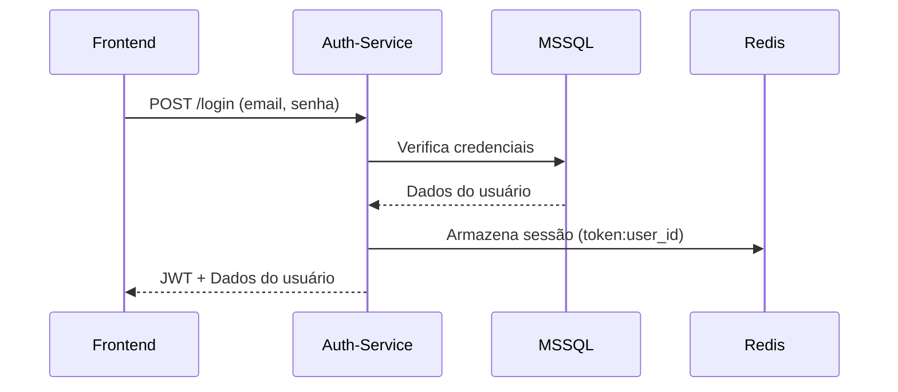

Acesso a rotas protegidas
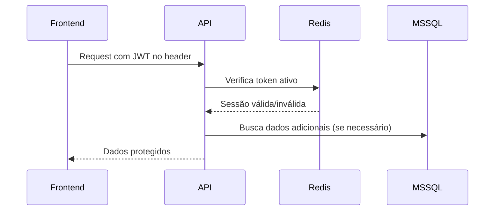

Refresh token
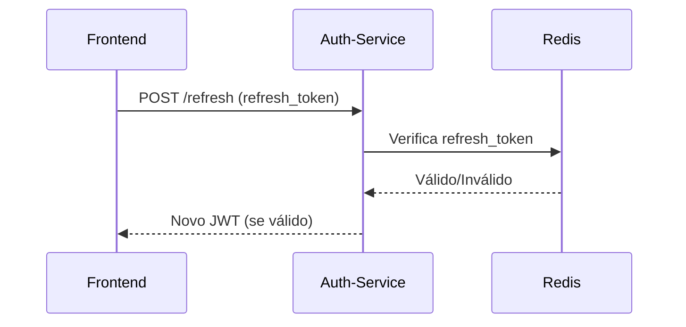
### Diagramas Gerais

##### Visão geral
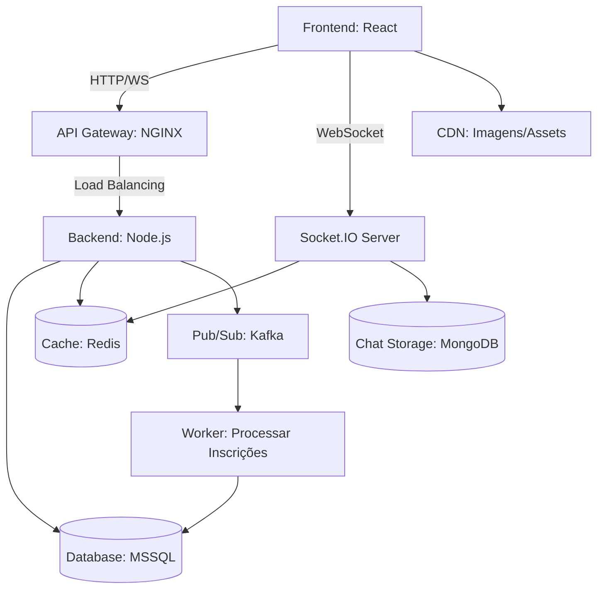

##### MSSQL
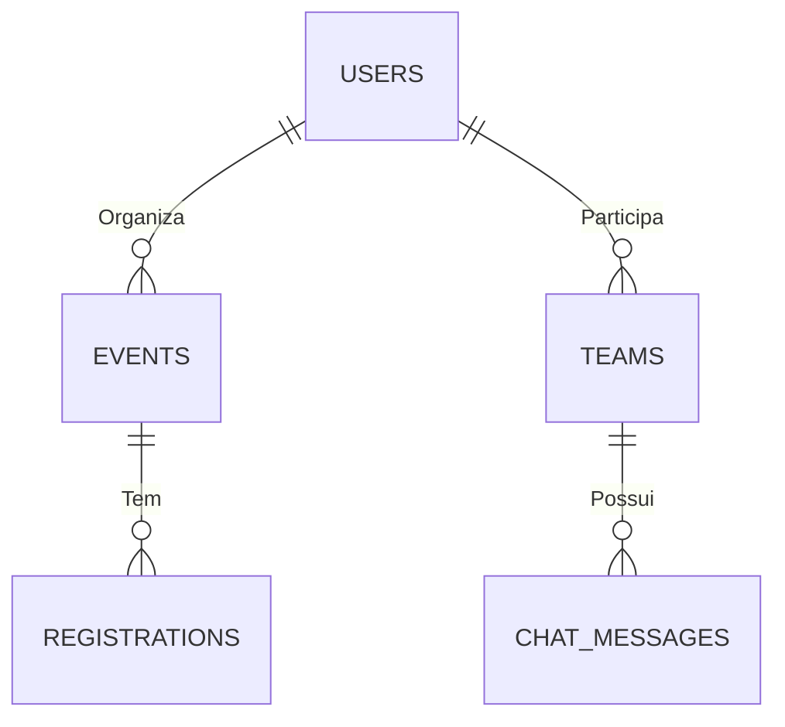
##### Sistema de Chat
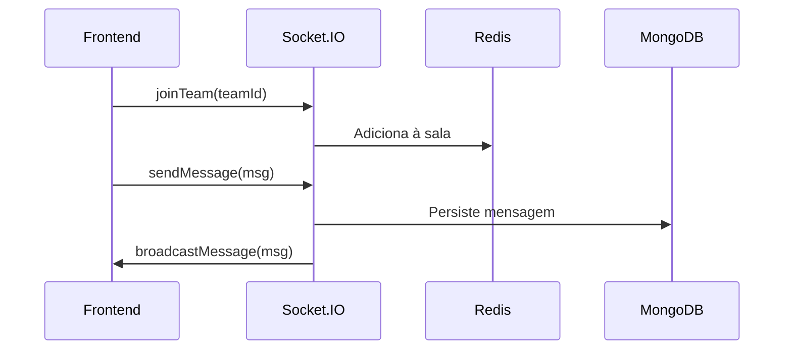

##### Criação de evento
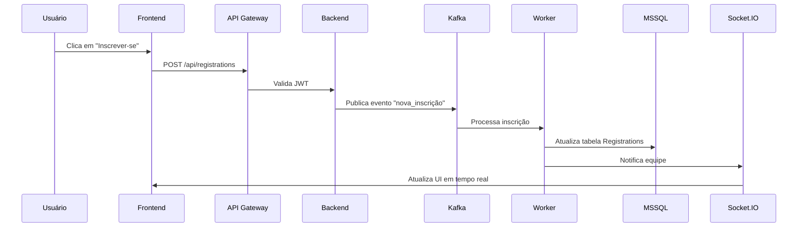

#### Fallbacks

##### Chat
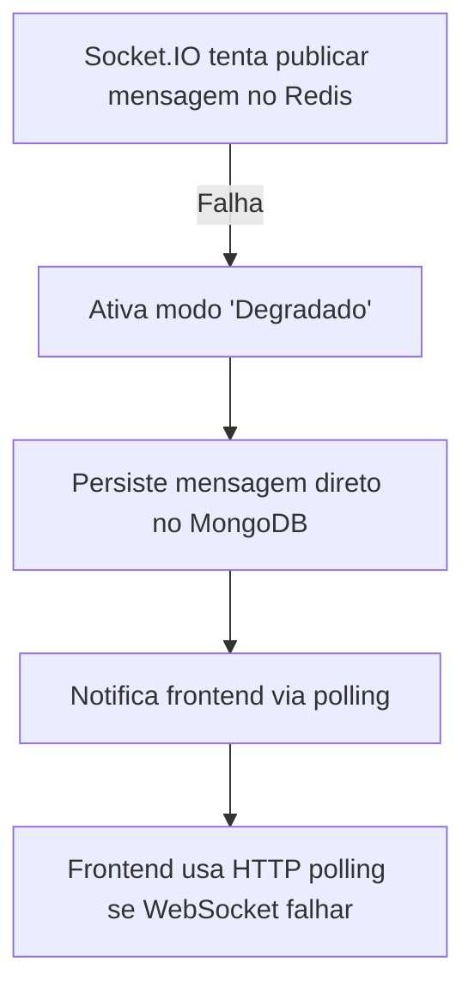

##### Kafka
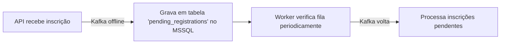

##### MSSQL
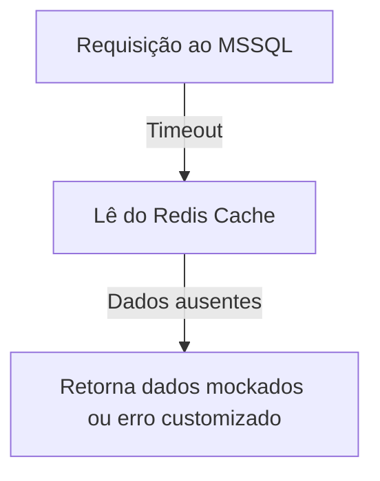

##### CDN
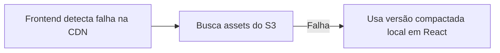
